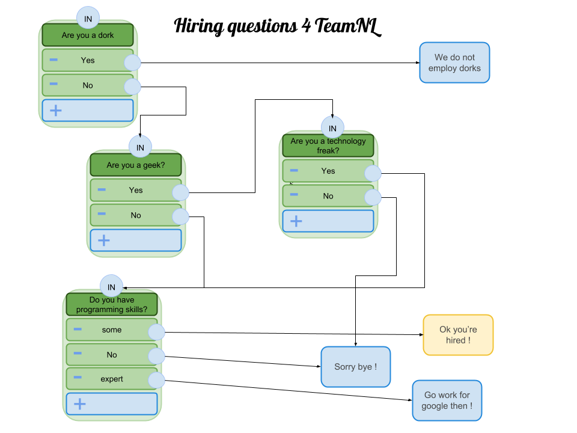

# Q&A Component Archecture

## Admin data visualization Tool
In order to create a question dialog / flow, the data should be visualized in terms of a flow like diagram.
See attached picture for example. This visualization is a representation of the data that eventually will need to
made computer readable in form of a json file [see attachment of json example data].
Eventually we could make a visualition tool available in tridion that will allow a webmaster to create the data for
a given flow. In the mvp version of the Q&A component the data will be created by hand according to the specifications of
a visual flow. A visual flow is the best understandable representation at this point.

## Data
- Two or more questions are part of a flow that will lead to an endpoint.
- Questions have 2 or more answers
- Selecting an answer will lead to the next step in the flow.
- The next step in a flow is always either another question or an endpoint.
- An endpoint that is reached by stepping through questions will have a representation in form of content
- The content of an endpoint will be an article component.
- The article should be content manageble

## Dialog runtime
- The runtime is responsible for rendering the flow with all its questions and endpoints from json data.
- The runtime needs a json data file that is defined by strict rules and format to describe a valid flow.
- The json data describes the relation between questions, answers and endpoints.
- The runtime will create a question component plus possible answers from a node-list in the json data.
- The runtime is responsible for rendering the content when an endpoint is reached.
- The runtime is a stand-alone script made a available in the tridion .nl template or packaged as part of the responsive template js.
- Runtime can be build with vanilla JS and does not need to be a senses feature.

## The Q&A tridion component for Webmasters
- The Q&A flow will made available as simple component in tridion.
- The webmaster will be able to create a component just as any other component.
- The component will have properties such as Title, description and most importantly the dataset.
- The dataset will be stored in tridion
- The dataset will be made available by tridion and publish as part of the page when the Q&A component is used.
- Alternatively the dataset is fetch client side if made available through the content api.

### MVP 1
- business creates data flow as described in example flow chart
- teamnl creates json data of the given flow by hand
- teamnl created Q&A runtime according to visual specification as described in JIRA.
- tridion component will created allong with placement of inline data in published page
- endpoint markup/html will be managed client side in mvp
- changes to Q&A flow will require changes in tridion
- changes to endpoint content will require changes in tridion
- nothing is content managable at this point

### VERSION 2
- includes all of MVP
- data is still created by teamnl if needed but can be updated in tridion by expert user.
- data is fetched by client component on .nl from tridion content server.
- raw json data is content managable

### VERSION 3
- includes all of MVP
- there will be a data flowchart tool in tridion
- changes in tridion will be immidiatly reflected on .NL
- fully content managable and idependent of teamnl and tridion once deployed.

# MVP Development tasks

- create visual representation Q&A flow
- create json data representation
- iterate through question and endpoint nodes
- create Q&A renderer
- create endpoint renderer
- make available as runtime in responsive template
- create visual affect when question appear and disappear
- fetch inline data (by name) and pass to runtime
- css work mobile and desktop
- create a function test page in RTP
- create unit tests for runtime with different data sets
- create tridion component
- publish json data with page when component is used

